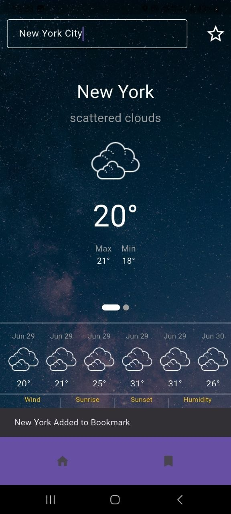

# 🌤️ weather_bloc

A Flutter weather app that lets you search for any city and view current conditions along with a 5-day / 3-hour forecast — built as a personal learning project to practice BLoC architecture, REST API integration, and local persistence.

---

## 📸 Screenshots

| Main Screen | Saved Cities |
|---|---|
|  |  |

---

## ✨ Features

- 🔍 **City search** with autocomplete suggestions powered by `flutter_typeahead`
- 🌡️ **Current weather** — temperature, weather condition, wind speed, humidity, sunrise & sunset times
- 📅 **5-Day / 3-Hour Forecast** — grouped forecast cards using the free OpenWeatherMap tier
- 💾 **Save favourite cities** — persisted locally with Floor (SQLite)
- 🎨 **Smooth UI** — loading animations and page indicators for a polished experience

---

## 🛠️ Tech Stack

| Layer | Technology |
|---|---|
| State management | BLoC / flutter_bloc |
| HTTP client | Dio |
| Local database | Floor (SQLite) |
| Dependency injection | GetIt |
| Weather data | OpenWeatherMap API (free tier) |
| Date formatting | intl |
| Testing | mockito + bloc_test |

---

## 📦 Dependencies

```yaml
dependencies:
  dio: ^5.9.2
  equatable: ^2.0.8
  bloc: ^9.2.1
  flutter_bloc: ^9.1.1
  get_it: ^9.2.1
  intl: ^0.20.2
  loading_animation_widget: ^1.3.0
  smooth_page_indicator: ^1.2.1
  flutter_typeahead: ^6.0.0
  floor: ^1.5.0
  cupertino_icons: ^1.0.8

dev_dependencies:
  floor_generator: ^1.5.0
  build_runner: ^2.4.15
  mockito: ^5.4.5
  bloc_test: ^10.0.0
```

---

## 🚀 Getting Started

### Prerequisites

- Flutter SDK `>=3.0.0`
- A free [OpenWeatherMap](https://openweathermap.org/api) API key

### Installation

1. **Clone the repository**
   ```bash
   git clone https://github.com/cyrus4u/weather_bloc.git
   cd weather_bloc
   ```

2. **Install dependencies**
   ```bash
   flutter pub get
   ```

3. **Generate Floor database code**
   ```bash
   dart run build_runner build --delete-conflicting-outputs
   ```

4. **Add your API key**

   Create a file at `lib/core/constants/api_constants.dart` (or wherever your constants live) and add:
   ```dart
   const String openWeatherApiKey = 'YOUR_API_KEY_HERE';
   ```
   > ⚠️ Never commit your API key. Add the file to `.gitignore`.

5. **Run the app**
   ```bash
   flutter run
   ```

---

## 🧪 Testing

This project uses `mockito` for mocking and `bloc_test` for testing BLoC logic.

```bash
flutter test
```

---

## 📡 API Used

[OpenWeatherMap — 5 Day / 3 Hour Forecast](https://openweathermap.org/forecast5)

> The free tier provides forecasts in 3-hour intervals for up to 5 days. No credit card required.

---

## 📁 Project Structure

```
lib/
├── core/               # Constants, DI setup, shared utilities
├── data/               # Models, Floor entities, repositories
├── domain/             # Use cases / business logic
├── presentation/       # BLoC, pages, widgets
└── main.dart
```

> _Adjust this tree to match your actual folder structure._

---

## 🎯 What I Learned

- Implementing clean BLoC architecture with state, event, and cubit separation
- Consuming a REST API with Dio and mapping JSON responses to Dart models
- Setting up Floor for local SQLite persistence with code generation
- Writing unit tests for BLoC logic using `bloc_test` and `mockito`
- Managing dependency injection with GetIt

---

## 📄 License

This project is for learning purposes and is not licensed for production use.
